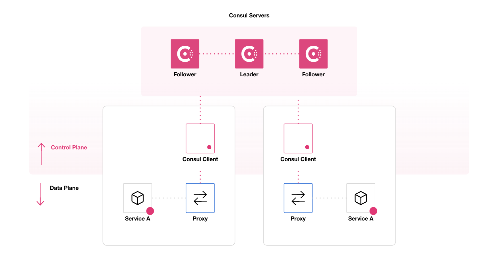
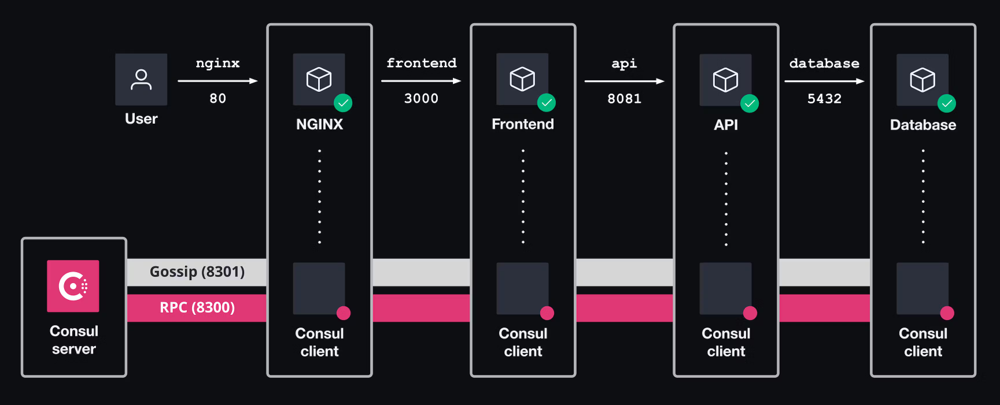
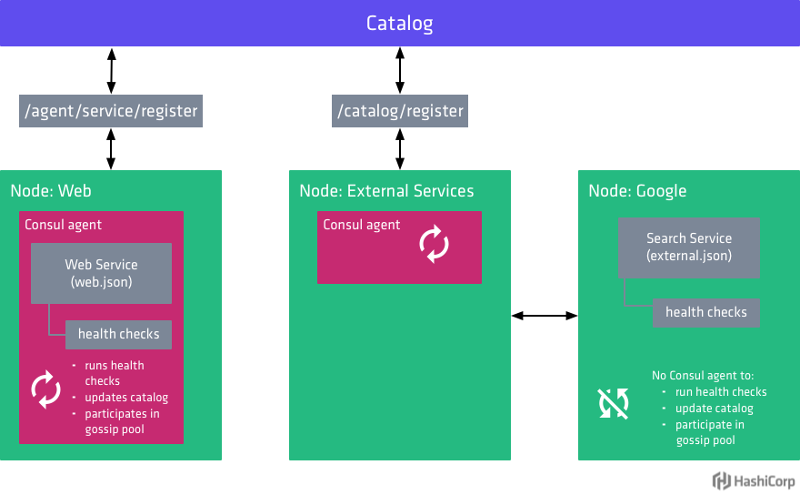

# infra-consul

## 簡介

HashiCorp Consul is a service networking solution that enables teams to manage secure network connectivity between services and across on-prem and multi-cloud environments and runtimes. Consul offers service discovery, service mesh, traffic management, and automated updates to network infrastructure device. You can use these features individually or together in a single Consul deployment.

Consul provides a control plane that enables you to register, query, and secure services deployed across your network. The control plane is the part of the network infrastructure that maintains a central registry to track services and their respective IP addresses. It is a distributed system that runs on clusters of nodes, such as physical servers, cloud instances, virtual machines, or containers.

The core Consul workflow consists of the following stages:

+ Register: Teams add services to the Consul catalog, which is a central registry that lets services automatically discover each other without requiring a human operator to modify application code, deploy additional load balancers, or hardcode IP addresses.
+ Query: Consul’s identity-based DNS lets you find healthy services in the Consul catalog.
+ Secure: After services locate upstreams, Consul ensures that service-to-service communication is authenticated, authorized, and encrypted.

## 指令

+ ```cli dev```：單一容器啟動，用於開發與試驗
+ ```cli up```：叢集主機啟動
+ ```cli down```：叢集主機關閉
+ ```cli secure```：產生加密所需資訊與設定
+ ```cli into --<service-main-name>```：進入指定容器
+ ```cli logs --<service-main-name>```：顯示指定容器歷程

## Server and Client

+ [Agents Overview](https://developer.hashicorp.com/consul/docs/agent)
+ [The Consul system – servers and clients](https://subscription.packtpub.com/book/cloud-and-networking/9781800202627/2/ch02lvl1sec03/the-consul-system-servers-and-clients)



Consul agent is the core process of Consul. The agent maintains membership information, registers services, runs checks, responds to queries, and more. The agent must run on every node that is part of a Consul cluster.

Agents run in either client or server mode.

+ Server nodes are the core agent operations,  participate in the consensus quorum. The quorum is based on the Raft protocol, which provides strong consistency and availability in the case of failure. Server nodes should run on dedicated instances because they are more resource intensive than client nodes.

+ Client nodes are lightweight processes that make up the majority of the cluster. They interface with the server nodes for most operations and maintain very little state of their own. Clients run on every node where services are running.

基於安全性考量，Consul 建議設定以下的加密機制以確保服務間的通訊安全。

#### [Gossip encrypt](https://developer.hashicorp.com/consul/tutorials/security/gossip-encryption-secure)

使用 [Consul Keygen](https://developer.hashicorp.com/consul/commands/keygen) 指令產生一組 32-bytes 的 Base64-encoded，用於 Consul 網路的加密通訊。

此值可透過 CLI 參數 ```-encrypt``` 或設定檔 ```encrypt``` 為 Key 來提供啟動的節點；在預設上可以不提供此一數值，但在產品環境則基於安全性必需設定。

在本專案可以使用

#### [TLS encryption](https://developer.hashicorp.com/consul/tutorials/security/tls-encryption-secure)

基於 Certificate Authority (CA) 的加密通訊，使用於 [TLS](https://zh.wikipedia.org/zh-tw/%E5%82%B3%E8%BC%B8%E5%B1%A4%E5%AE%89%E5%85%A8%E6%80%A7%E5%8D%94%E5%AE%9A)，諸如 HTTP(S) 的通訊即是使用此通訊加密。

#### [ACL](https://developer.hashicorp.com/consul/tutorials/security/access-control-setup-production)

基於 [Access Control List](https://developer.hashicorp.com/consul/docs/security/acl#acl-documentation) 的加密通訊。

## Service discovery

+ [Register external services with Consul service discovery](https://developer.hashicorp.com/consul/tutorials/developer-discovery/service-registration-external-services)
    + [Register your services to Consul](https://developer.hashicorp.com/consul/tutorials/get-started-vms/virtual-machine-gs-service-discovery)
+ [Services](https://developer.hashicorp.com/consul/docs/services/services)
    + [Define services](https://developer.hashicorp.com/consul/docs/services/usage/define-services)
    + [Define health checks](https://developer.hashicorp.com/consul/docs/services/usage/checks)
        - [Checking service health status with Consul](https://codeblog.dotsandbrackets.com/consul-health-check/)
    + [Register services and health checks](https://developer.hashicorp.com/consul/docs/services/usage/register-services-checks)
        - [Service - Agent HTTP API](https://developer.hashicorp.com/consul/api-docs/agent/service)

A service is an entity in your network that performs a specialized operation or set of related operations. In many contexts, a service is software that you want to make available to users or other programs with access to your network.

You can define and register services with Consul, which makes them discoverable to other services in the network. You can also define various types of health checks that perform several safety functions, such as allowing a web balancer to gracefully remove failing nodes and allowing a database to replace a failed secondary.






在 Consul，服務可以分為內部 ( Internal ) 與外部 ( External ) 服務，因此，針對不同的服務來源需採用不同的狀態檢查機制。

#### Register

You must tell Consul about the services deployed to your network if you want them to be discoverable. You can define services by three way:

+ Define in a configuration file.
+ Register your service using the consul services command.
+ Send the service definition parameters as a payload to the /agent/service/register API endpoint.

##### Configuration file

使用配置檔，範例參考 [./app/client/default/services.json](service.json) 檔，詳細設定則參考文獻 [Services configuration reference](https://developer.hashicorp.com/consul/docs/services/configuration/services-configuration-reference)。

```
{
  "services": [
    {
      "id": "srv1",
      "name": "internal-srv",
      ...
    }
  ]
}
```

其主要設定檔句型結構如上，在此 ```services``` 的矩陣中設定不同 ```name```、```id``` 來註冊一個服務，在整個設定中，其主要是規劃註冊服務的網路通訊資訊，以及狀態檢查機制 ```check```。

##### CLI

使用指令介面，範例參考 [register-service-with-cli.sh](./src/client/register-service-with-cli.sh) 檔，操作文獻參考 [Consul Agent Services](https://developer.hashicorp.com/consul/commands/services)。

範例使用操作如下：

+ 使用指令```cli.bat into --client-1``` 進入容器
+ 前往腳本目錄 ```cd src```
+ 執行腳本 ```sh ./register-service-with-cli.sh```

此範例執行會出現如下錯誤 ```Unexpected response code: 400 (Invalid check: TTL must be > 0 for TTL checks)```，此項錯誤是目前已知的異常議題，因為 Consul 在檢查配置資訊時將其判斷為 TTL 模式導致錯誤。

+ [Get error: Unexpected response code: 400 (Invalid check: TTL must be > 0 for TTL checks) when register service with args check](https://discuss.hashicorp.com/t/get-error-unexpected-response-code-400-invalid-check-ttl-must-be-0-for-ttl-checks-when-register-service-with-args-check/34215)
+ [Service UDP Check: TTL must be > 0 for TTL checks](https://github.com/hashicorp/consul/issues/14864)

目前已知可使用 Configuration 與 API 替代此項服務註冊。

##### API

使用指令介面，範例參考 [register-service-with-api.sh](./src/client/register-service-with-cli.sh) 檔，操作文獻參考 [Service - Agent HTTP API](https://developer.hashicorp.com/consul/api-docs/agent/service)。

範例使用操作如下：

+ 使用指令```cli.bat into --client-1``` 進入容器
+ 前往腳本目錄 ```cd src```
+ 執行註冊腳本 ```sh ./register-service-with-api.sh```
+ 執行資訊取回腳本 ```sh ./services-info.sh```

#### Type

##### Internal service

+ Shell
+ Python Consul
+ Executable file

##### External service

+ Nginx
+ .NET Server
+ Node.js Server

#### health check

#### key-value storage

## 文獻

+ [Consul](https://www.consul.io/)
    - [What is Consul?](https://developer.hashicorp.com/consul/docs/intro)
    - [Consul Architecture](https://developer.hashicorp.com/consul/docs/architecture)
+ [Consul - Docker](https://hub.docker.com/_/consul)
    - [hashicorp/consul - Docker](https://hub.docker.com/r/hashicorp/consul)，1.16 之後版本發布於此。
    - [Create a secure local Consul datacenter with Docker Compose](https://developer.hashicorp.com/consul/tutorials/docker/docker-compose-datacenter)
        + [Agents Configuration File Reference](https://developer.hashicorp.com/consul/docs/agent/config/config-files)
        + [Service Configuration File Reference](https://developer.hashicorp.com/consul/docs/services/configuration/services-configuration-reference)
        + [Health check configuration reference](https://developer.hashicorp.com/consul/docs/services/configuration/checks-configuration-reference)
+ 教學文章
    - [Consul 1.9 中文文档](https://yushuai-w.gitbook.io/consul/intro)
        + [Consul 1.4 中文文档](https://kingfree.gitbook.io/consul/)
    - [Introduction to Consul Made Simple](https://reemishirsath.medium.com/introduction-to-consul-made-simple-5749b79e1)
    - [使用 Consul 作為成員資格提供者](https://learn.microsoft.com/zh-tw/dotnet/orleans/deployment/consul-deployment)
    - [HashiCorp釋出多雲服務平臺Consul 1.9版，強化存取控制與視覺化功能](https://www.ithome.com.tw/news/141383)
    - [什麼是Consul？Consul的基本架構和安裝介紹！](https://www.gushiciku.cn/pl/gUzz/zh-tw)
    - [基于Consul的服务发现](https://yunlzheng.gitbook.io/prometheus-book/part-ii-prometheus-jin-jie/sd/service-discovery-with-consul)
    - [使用Consul做服務發現的若幹姿勢](https://www.zendei.com/article/60622.html)
    - [使用 consul 及 nomad 建立起 dc 的基礎建設](https://poyu677.medium.com/8c4a8bedcd3f)
